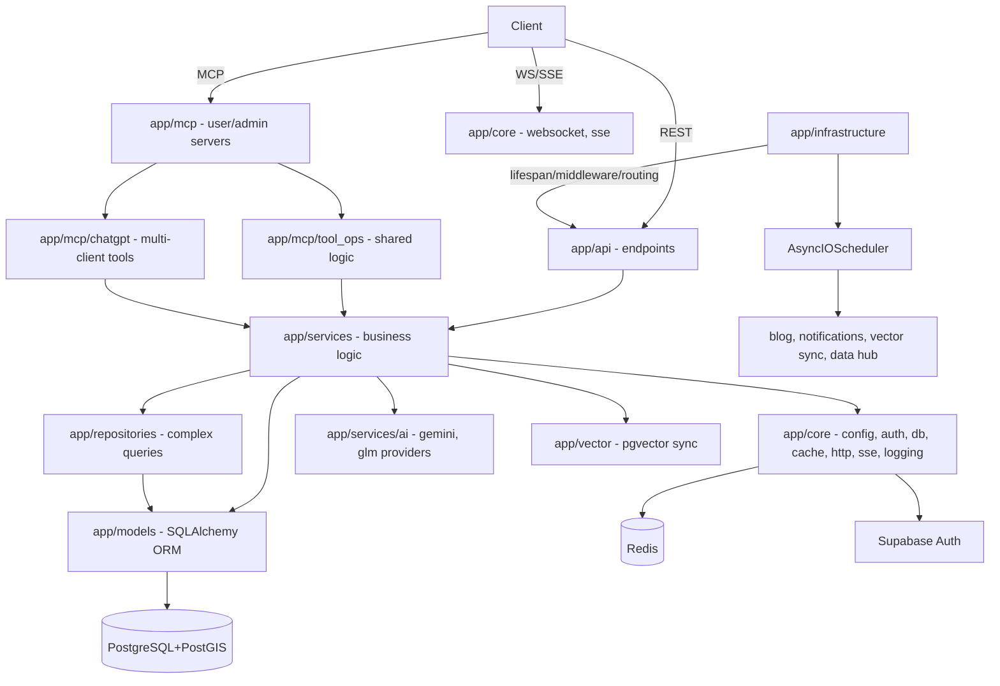

# 360Ghar Backend Survey Context

## Repo summary

360Ghar is a unified real estate platform backend built with FastAPI, PostgreSQL+PostGIS, SQLAlchemy 2.x async, and Pydantic v2. It powers six integrated modules — Core marketplace, 360 Stays, Flatmates, Property Management, 360 Virtual Tours, and the 360 Data Hub — from a single async codebase authenticated against Supabase Auth. The API exposes both a REST surface (`/api/v1/*`) and two MCP servers (`/mcp`, `/mcp-admin`) for LLM clients. Tech stack: Python 3.10+, uv for deps, Redis cache, pgvector semantic search, Cloudinary media, Sentry observability, Railway deployment.

## Architecture overview

Layered structure: `app/infrastructure/` (composition root, lifespan, middleware, MCP mounts) → `app/api/` (thin REST controllers) → `app/services/` (async business logic, the largest layer) → `app/repositories/` (complex queries) + `app/models/` (ORM) + `app/core/` (cross-cutting: config, auth, db, cache, http, sse, logging). MCP servers and the AI agent both call into the shared service layer via `app/mcp/tool_ops/` and `app/services/ai_agent/tool_bridge.py`.

## Discovered topics

**Features (cross-cutting product capabilities):**
- Ghar Core: properties, swipes, visits, agents (`app/api/api_v1/endpoints/properties.py`, `swipes.py`, `visits.py`, `agents.py`)
- 360 Stays: bookings (`bookings.py`, `app/services/booking.py`)
- Flatmates: matching, conversations, moderation, profiles (`app/services/flatmates/`)
- Property Management: leases, rent, maintenance, documents, inspections, reports, tenants, applications (`app/services/pm_*.py`, endpoints `pm_*.py`)
- 360 Virtual Tours: tours, scenes, hotspots, floor plans, AI jobs, analytics (`app/services/tour/`, `app/services/tour_ai/`)
- 360 Data Hub: 26 scraper modules — bank auctions, RERA, circle rates, gazette, jamabandi, zoning, neighbourhood (`app/services/data_hub/`)
- MCP servers: user MCP (`/mcp`), admin MCP (`/mcp-admin`), OAuth 2.1 + PKCE, 11 React widgets (`app/mcp/`, `chatgpt-widgets/`)
- AI Agent: Pydantic AI agent with tool bridge, conversation store, system prompt (`app/services/ai_agent/`)
- Blog: auto-publish scheduler, SEO fields, AI generation (`app/services/blog.py`, `blog_auto_publish.py`, `blog_service/generator.py`)
- Notifications: multi-channel dispatch (push/email/sms/in-app), FCM, type registry (`app/services/notification_config.py`, `notification_dispatcher.py`, `notifications/`)
- Vastu: AI analyzer for floor plans (`app/services/ai/vastu/`)
- AI Design Studio: image generation (`app/services/ai/image_gen/`, endpoint `design_studio.py`)
- Webhooks: inbound integrations (`app/api/api_v1/endpoints/webhooks/`)
- OAuth: token store, endpoints for MCP (`app/services/oauth_token_store.py`, `app/api/api_v1/endpoints/oauth/`)
- Payments: payment endpoints (`payments.py`, `app/services/payments.py`)

**Systems (internal building blocks):**
- API layer: 333 endpoints across 38 endpoint modules, dependencies for auth (`app/api/api_v1/dependencies/auth.py`)
- Services layer: 50+ service modules, async-first, service-class pattern
- Repositories: BaseRepository, PropertyRepository, PropertyQueryBuilder (`app/repositories/`)
- Models: 68 ORM tables across 18 model files + `enums.py` with 50+ enums (`app/models/`)
- Infrastructure: lifespan, middleware (4 modules), errors, MCP construction, routing, scheduler (`app/infrastructure/`)
- Core cross-cutting: config, auth (JWT verification, Supabase), database (async engine, NullPool serverless), cache (memory+Redis backends, decorators), http (4 shared httpx clients), sse (event bus), logging (structured, request IDs), jwt_verification, db_resilience, websocket, exceptions, utils (`app/core/`)
- Vector search: pgvector embeddings, sync scheduler, backfill (`app/vector/`)
- Cache subsystem: interface, memory+Redis backends, manager, decorators, keys (`app/core/cache/`)
- Storage: Cloudinary service, paths, image processing (`app/services/storage/`, `storage_paths.py`, `image_processing.py`)
- AI providers: base, Gemini, GLM, image generation (`app/services/ai/`)

**Primitives (foundational domain objects):**
- User (`app/models/users.py`, `app/services/user.py` — 951 lines, largest file)
- Property (`app/models/properties.py`, `app/services/property/` — crud/search/recommendations)
- Agent (`app/models/agents.py`, `app/services/agent.py`)
- Booking (`app/models/bookings.py`)
- Visit (`app/models/` via visits)
- Lease (`app/models/pm_leases.py`)
- Tour (`app/models/tours.py` — 21,979 bytes, largest model file)
- Social entities: UserMatch, UserConversation, UserMessage, UserBlock, UserReport (`app/models/social.py`)

## Key patterns

- **Async-first**: All DB ops and services use async/await. Services inject `AsyncSession` via FastAPI deps.
- **Service layer pattern**: `class XService: def __init__(self, db: AsyncSession)`. Business logic in `app/services/`, endpoints are thin controllers.
- **Shared MCP tool logic**: `app/mcp/tool_ops/` holds business logic called by both MCP servers and the AI agent tool bridge — no duplication.
- **Shared httpx clients**: 4 singletons in `app/core/http.py` (scraper 30s, blog 120s, general 30s, supabase-auth 10s). Never create ephemeral `async with httpx.AsyncClient()`.
- **Single scheduler**: One `AsyncIOScheduler` from `app/infrastructure/scheduler.py`, registered in lifespan. No per-module schedulers.
- **SSE event bus**: `app/core/sse.py` per-user pub/sub. Services call `await sse_bus.emit(user_id, event)` after commit. Events: `new_match`, `new_message`, `conversation_updated`, `visit_updated`, `listing_status_changed`, `new_notification`.
- **Serverless mode**: `SERVERLESS_ENABLED=True` → NullPool, skip schedulers, in-memory cache fallback. Scale-to-zero with PgBouncer.
- **Overlapping bookings allowed**: Same property can be booked by multiple people for overlapping dates. No double-booking guards.
- **Auth**: Supabase JWT via `get_current_user` dep. Phone is primary identifier. Backend has no `/auth/*` session endpoints — clients own login/refresh/logout via Supabase SDK. `PROVIDER_UNREACHABLE` → HTTP 503 with `Retry-After: 5` (distinguishes Supabase outage from bad JWT).
- **DB session hygiene for streaming**: SSE/streaming endpoints release main-pool session, use `get_bg_db` background pool.
- **3-tuple service returns**: Property list/search/recommendations return `(items, next_cursor, has_more)` tuples for cursor pagination (recent refactor, June 2026).
- **Coding conventions**: `from __future__ import annotations` first import. `X | None` not `Optional[X]`. `list[X]` not `List[X]`. B904 exception chaining. E712 no `== True`. Ruff enforced in CI.

## Glossary seeds

- **Ghar** — Hindi for "home". The platform brand.
- **Flatmates** — Roommate/PG discovery module with swipe-based matching.
- **Vastu** — Vastu Shastra, traditional Hindu system of architecture. The vastu analyzer checks floor plan compliance.
- **RERA** — Real Estate (Regulation and Development) Act, 2016. Indian real estate regulator. Data hub scrapes RERA projects and complaints.
- **Jamabandi** — Hindi/Punjabi term for land revenue records (property ownership documents). Data hub scrapes these.
- **Circle Rate** — Government-set minimum property price per area, used for stamp duty calculation.
- **Gazette** — Official government notifications (land acquisition, rate revisions, policy changes).
- **SARFAESI** — Securitisation and Reconstruction of Financial Assets and Enforcement of Securities Interest Act. Bank auction source.
- **PG** — Paying Guest accommodation. A property type in the flatmates module.
- **Swipe** — Tinder-like property/user interaction (like, pass, super_like).
- **MCP** — Model Context Protocol. The backend exposes two MCP servers for LLM clients.
- **PM** — Property Management module (leases, rent, maintenance).
- **RM** — Relationship Manager. Owner-to-RM assignments in PM.

## Directory-to-purpose map

| Directory | Wiki topic |
|---|---|
| `app/api/api_v1/endpoints/` | api/index.md, features/*.md |
| `app/api/api_v1/dependencies/` | api/authentication.md |
| `app/services/` (top-level) | systems/services-layer.md, features/*.md |
| `app/services/flatmates/` | features/flatmates.md |
| `app/services/data_hub/` | features/data-hub.md |
| `app/services/ai/` | systems (AI providers), features/vastu.md |
| `app/services/ai_agent/` | features/ai-agent.md |
| `app/services/blog*.py` | features/blog.md |
| `app/services/notification*.py` | features/notifications.md |
| `app/services/pm_*.py` | features/property-management.md |
| `app/services/tour/`, `tour_ai/` | features/virtual-tours.md |
| `app/services/storage/`, `storage_paths.py` | systems (storage) |
| `app/services/property/` | features/ghar-core.md, primitives/property.md |
| `app/models/` | systems/models.md, primitives/*.md, reference/data-models.md |
| `app/mcp/` | features/mcp-servers.md |
| `app/mcp/tool_ops/` | features/mcp-servers.md |
| `app/mcp/chatgpt/` | features/mcp-servers.md |
| `app/core/` | systems/core-cross-cutting.md, systems/cache-subsystem.md |
| `app/core/cache/` | systems/cache-subsystem.md |
| `app/repositories/` | systems/repositories.md |
| `app/middleware/` | systems/infrastructure.md, security.md |
| `app/infrastructure/` | systems/infrastructure.md |
| `app/vector/` | systems/vector-search.md |
| `app/schemas/` | reference/data-models.md |
| `chatgpt-widgets/` | features/mcp-servers.md |
| `seed_data/` | how-to-contribute/development-workflow.md |
| `scripts/` | how-to-contribute/tooling.md |
| `docs/` | background/design-decisions.md |
| `supabase/migrations/` | reference/data-models.md |

## Key statistics

- **Lines of code**: 67,841 in `app/`, 33,125 in `tests/` (49% test-to-code ratio)
- **Source files**: 352 Python files in `app/`, 159 test files
- **Endpoints**: 333 REST endpoints across 38 endpoint modules
- **ORM models**: 68 `__tablename__` tables across 18 model files
- **MCP tools**: 40+ across user and admin servers
- **Enums**: 50+ in `app/models/enums.py` (563 lines)
- **Widgets**: 11 React widget HTML bundles in `chatgpt-widgets/dist/`
- **Data hub scrapers**: 26 modules in `app/services/data_hub/`
- **Dependencies**: Python (FastAPI, SQLAlchemy 2.x, Pydantic v2, httpx, APScheduler, pgvector, GeoAlchemy2, Supabase, FastMCP 3.0.1, Pydantic AI, Pillow, Cloudinary, Sentry SDK), JS (React 18, esbuild, TypeScript)
- **Largest files**: `app/services/user.py` (951), `app/services/blog.py` (930), `app/services/storage/service.py` (723), `app/services/property/search.py` (707), `app/services/ai_agent/tools/owner.py` (676)

## Git history highlights

- **Total commits**: 182
- **Commits in last 90 days**: 87 (highly active)
- **Contributors**: Saksham Mittal (165), Ravi Sahu (16), railway-app[bot] (1)
- **Bot co-authored commits**: 0 explicit, but the vast majority are AI-assisted (single primary contributor using AI tooling)
- **No tags/releases** yet
- **Earliest app code**: June 29, 2025 ("fastapi" commit) — project is ~1 year old
- **Major eras**:
  - Jun–Aug 2025: Initial FastAPI scaffold, property/user models, data population
  - Oct 2025: Blog APIs and model refactor
  - Nov 2025: Notification and email services
  - Jan 2026: Caching system, property management features, MCP server (FastMCP)
  - Mar 2026: Data hub — 11 scraper service files added
  - May 2026: Major refactor — decompose monoliths into packages, add flatmates social feature, restructure MCP servers
  - May–Jun 2026: Flatmates interactions, super likes, moderation, profile filters; data hub improvements
  - Jun 2026: API standardization — cursor pagination across users, agents, bookings, visits, blog, properties (3-tuple returns). This is the current active work.
- **Churn hotspots (90 days)**: `app/core/config.py` (14), `app/services/user.py` (13), `app/services/property/crud.py` (12), `app/services/property/search.py` (11), `app/services/flatmates/profiles.py` (11), `app/core/auth.py` (11)

## Notable findings for wiki

1. **4 ADRs** in `docs/adrs/`: domain module structure, repository protocol interfaces, external service adapters, event-driven side effects. These inform `background/design-decisions.md`.
2. **Overlapping bookings business rule** — deliberately no double-booking guards. Important to document in `background/pitfalls.md`.
3. **Serverless mode** with NullPool trade-offs — `background/pitfalls.md`.
4. **MCP widget system** — 11 React widgets with dual-metadata strategy (standard MCP + OpenAI aliases), multi-host bridge. Complex enough for a dedicated section in `features/mcp-servers.md`.
5. **3-tuple cursor pagination refactor** (June 2026) — recent, ongoing. Documented in `systems/api-layer.md` and `how-to-contribute/patterns-and-conventions.md`.
6. **Auth resilience** — `PROVIDER_UNREACHABLE` → 503 with Retry-After. Documented in `api/authentication.md`.
7. **Startup migrations** — lifespan applies lightweight DDL (enum additions, column adds) that can't go through Supabase CLI. Documented in `systems/infrastructure.md`.
8. **DNS prewarm** for Supabase at startup. Documented in `systems/infrastructure.md`.
9. **TODO/FIXME count is only 2** — very clean codebase. `cleanup-opportunities/` will be thin.
10. **No CODEOWNERS file** — solo/duo project. `maintainers.md` will note 2 contributors.

## Subsystem criticality

**Critical (large/central, dedicated agent):**
- `features/mcp-servers.md` — 40+ tools, 11 widgets, OAuth, dual metadata. Largest feature.
- `features/property-management.md` — 12 pm_* services + 12 endpoints.
- `features/data-hub.md` — 26 scrapers, scheduler, alerts.
- `features/flatmates.md` — 7 service modules, SSE, moderation.
- `systems/infrastructure.md` — lifespan, middleware, MCP mounts, scheduler.
- `systems/core-cross-cutting.md` — config, auth, db, cache, http, sse, logging.
- `reference/data-models.md` — 68 tables, ERD.

**Normal (batched):**
- `features/ghar-core.md`, `features/stays.md`, `features/virtual-tours.md`, `features/ai-agent.md`, `features/blog.md`, `features/notifications.md`, `features/vastu.md`
- `systems/api-layer.md`, `systems/services-layer.md`, `systems/repositories.md`, `systems/models.md`, `systems/vector-search.md`, `systems/cache-subsystem.md`
- All `primitives/*.md`, `overview/*.md`, `how-to-contribute/*.md`, conditional sections, `reference/*.md`
