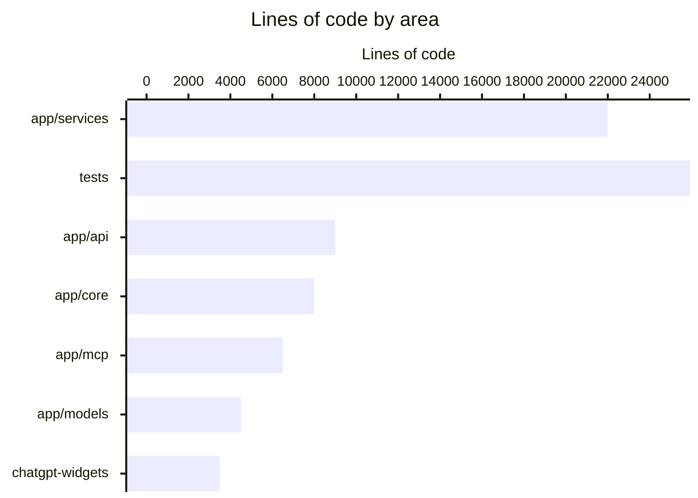

# By the numbers

Data collected on 2026-06-19.

A quantitative snapshot of the 360Ghar backend. Numbers describe the repository at `app/`, `tests/`, and `chatgpt-widgets/` plus a few tooling paths. For the narrative behind these figures, see [lore.md](lore.md).

## Size and shape

| Metric | Value |
|---|---|
| Source lines (Python) | 67,841 in `app/` |
| Test lines | 33,125 in `tests/` |
| Test-to-code ratio | 49% |
| Python source files | 352 |
| Test files | 159 |
| Model files | 18 |
| REST endpoints | 333 across 38 endpoint modules |
| ORM tables | 68 across 18 model files |
| MCP tools | 40+ across user and admin servers |
| Enums | 50+ in `app/models/enums.py` |
| Data hub scrapers | 26 modules in `app/services/data_hub/` |
| Widgets | 11 React HTML bundles in `chatgpt-widgets/dist/` |

## Language breakdown

The backend is 100% Python. The `chatgpt-widgets/` package adds a small TypeScript/React surface for MCP generative UI. The chart below shows approximate lines of code by area.

> Bar values are rounded order-of-magnitude estimates derived from the directory-to-purpose map; they are not recomputed per build. Use `cloc app/ tests/ chatgpt-widgets/` for a live count.

## Activity

| Metric | Value |
|---|---|
| Total commits | 182 |
| Commits in last 90 days | 87 |
| Contributors | 2 humans (Saksham Mittal, Ravi Sahu) plus `railway-app[bot]` for deploys |
| Tags or releases | None |
| Project age | ~12 months (first commit June 29, 2025) |

Bot attribution is light: zero commits carry an explicit `Co-authored-by: bot` trailer. In practice the vast majority of human commits are AI-assisted, given a single primary contributor and the cadence. We mention this so the figures are not read as a hand-written line count.

## Churn hotspots (last 90 days)

Files most often touched, by commit count over the trailing 90 days:

| File | Commits |
|---|---|
| `app/core/config.py` | 14 |
| `app/services/user.py` | 13 |
| `app/services/property/crud.py` | 12 |
| `app/services/property/search.py` | 11 |
| `app/services/flatmates/profiles.py` | 11 |
| `app/core/auth.py` | 11 |

These cluster around configuration, auth, property search, and the flatmates profile pipeline. They overlap with the active API standardization effort described in [lore.md](lore.md).

## Complexity

Largest source files by line count:

| File | Lines |
|---|---|
| `app/services/user.py` | 951 |
| `app/services/blog.py` | 930 |
| `app/services/storage/service.py` | 723 |
| `app/services/property/search.py` | 707 |
| `app/services/ai_agent/tools/owner.py` | 676 |

Code hygiene is strong: only 2 `TODO`/`FIXME` markers across the source tree. No deprecated features or major rewrites; the project is young enough that growth has been additive.

## What to take away

- A mid-sized async Python service with a real test discipline (49% test ratio, 90% coverage gate in CI).
- A single primary contributor driving AI-assisted commits at a steady cadence.
- Hotspots map to the active refactor: pagination standardization, property search, and flatmates.
- The MCP surface (40+ tools, 11 widgets) is large relative to the rest of the codebase and warrants the dedicated attention it gets in [features/mcp-servers.md](features/mcp-servers.md).
