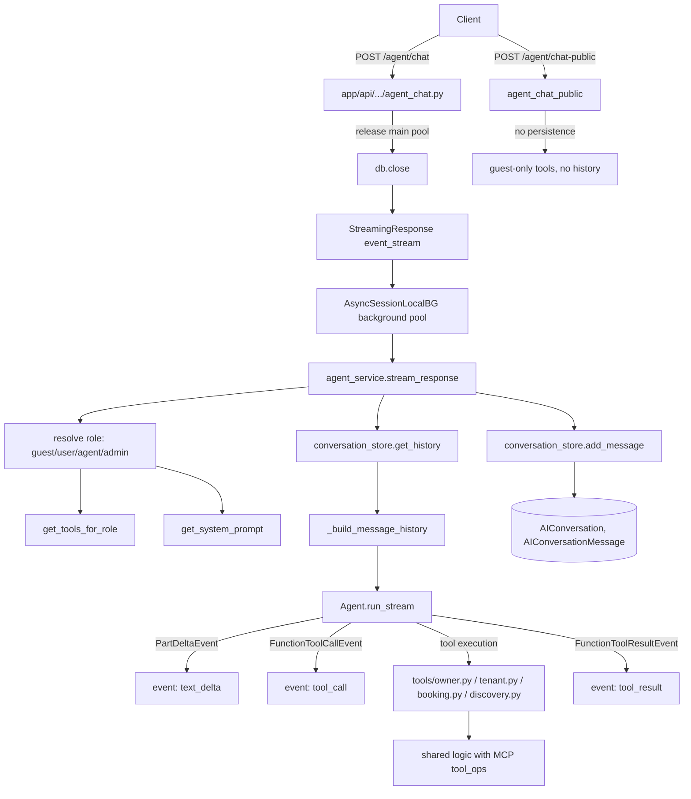

# AI agent

Active contributors: Saksham, Ravi

The AI agent is a conversational real estate concierge built on Pydantic AI. It streams responses to the client over SSE, calls into the same shared tool layer as the [MCP servers](mcp-servers.md), persists full conversation history (including tool calls and results), and supports both authenticated and guest modes with role-aware tool sets and system prompts.

## Directory layout

```
app/api/api_v1/endpoints/
└── agent_chat.py          # /agent/chat, /agent/chat-public, conversations CRUD
app/services/ai_agent/
├── __init__.py
├── agent_service.py       # Agent instance, stream_response, message history builder
├── conversation_store.py  # get_or_create_conversation, add_message, get_history, list
├── system_prompt.py       # role-aware prompts (guest, user, admin)
├── tool_bridge.py         # deprecated shim re-exporting from tools/
└── tools/
    ├── __init__.py        # USER_TOOLS, ADMIN_TOOLS, GUEST_TOOLS, get_tools_for_role
    ├── discovery.py       # guest_property_search, guest_property_details, guest_property_recommendations
    ├── owner.py           # owner_* and agent_* tools (676 lines)
    ├── tenant.py          # tenant_* tools
    ├── booking.py         # bookings_* and agent_bookings_* tools
    ├── helpers.py         # AgentDeps, _user_schema
    └── visits.py          # visits re-exports
app/models/
└── ai_conversations.py    # AIConversation, AIConversationMessage
```

## Key abstractions

| Abstraction | File | Role |
|---|---|---|
| `Agent` | `app/services/ai_agent/agent_service.py` | Pydantic AI Agent built on `OpenAIChatModel` via `OpenAIProvider` |
| `stream_response` | `app/services/ai_agent/agent_service.py` | Async generator yielding SSE events for model deltas + tool calls |
| `_build_message_history` | `app/services/ai_agent/agent_service.py` | Reconstructs `ModelMessage` list including `ToolCallPart` / `ToolReturnPart` pairs |
| `get_tools_for_role` | `app/services/ai_agent/tools/__init__.py` | Returns `GUEST_TOOLS`, `USER_TOOLS`, or `USER_TOOLS + ADMIN_TOOLS` |
| `get_system_prompt` | `app/services/ai_agent/system_prompt.py` | Assembles BASE_PROMPT + role-specific section |
| `get_or_create_conversation` | `app/services/ai_agent/conversation_store.py` | Loads or creates an `AIConversation` row |
| `add_message` | `app/services/ai_agent/conversation_store.py` | Persists messages with role, content, tool_name, tool_args, tool_result |
| `AgentDeps` | `app/services/ai_agent/tools/helpers.py` | Dependency container passed to Pydantic AI tools |

## How it works

The agent is constructed with `OpenAIChatModel` (configured via `settings`) and `OpenAIProvider`. Each chat request resolves the user's role, calls `get_tools_for_role(role)` to pick the tool set, calls `get_system_prompt(role)` to build the prompt, loads conversation history via `conversation_store.get_history`, and runs `Agent.run_stream` with the reconstructed `ModelMessage` history. The streaming response yields Pydantic AI events (`PartStartEvent`, `PartDeltaEvent`, `FunctionToolCallEvent`, `FunctionToolResultEvent`) which the service formats into SSE events (`text_delta`, `tool_call`, `tool_result`, `done`, `error`).



Tool execution is shared with the [MCP servers](mcp-servers.md). The `tools/` package re-implements the tool functions as Pydantic AI tools (not MCP wire calls), but they delegate to the same `app/mcp/tool_ops/` and `app/services/*` layer. `USER_TOOLS` covers owner, tenant, booking, and system tools. `ADMIN_TOOLS` adds agent-scoped property, lease, rent, maintenance, booking, and dashboard tools. `GUEST_TOOLS` exposes only `guest_property_search`, `guest_property_details`, and `guest_property_recommendations`.

The system prompt is role-aware. `BASE_PROMPT` sets the persona ("360Ghar AI Assistant, a helpful real estate concierge") and guidelines (use tools, no fabrication, markdown formatting, short answers, confirm writes). `USER_TOOLS_SECTION` lists owner, tenant, booking, and system capabilities. `ADMIN_TOOLS_SECTION` adds managed properties, lease management, rent collection, maintenance management, booking management, and dashboard capabilities. `GUEST_TOOLS_SECTION` plus `GUEST_FOOTER` instruct the agent to offer sign-in for authenticated features but never refuse property search.

Conversation persistence stores every turn in `AIConversationMessage` rows with `role` (`user`, `assistant`, `tool_call`, `tool_result`), `content`, `tool_name`, `tool_args`, and `tool_result`. `_build_message_history` reconstructs the full Pydantic AI `ModelMessage` list including `ToolCallPart` / `ToolReturnPart` pairs so the LLM retains tool context across turns. The first user message auto-generates a conversation title (truncated to 60 chars).

Guest mode (`/agent/chat-public`) is rate-limited at 10 requests per 60 seconds per IP via `EndpointRateLimiter` and uses no conversation persistence — each request is stateless with an empty history. Both endpoints release the main-pool DB session before streaming and use `AsyncSessionLocalBG` for tool calls, matching the SSE session-hygiene pattern.

## Integration points

- **MCP tool_ops**: tools delegate to `app/mcp/tool_ops/` and `app/services/*`, sharing logic with the [MCP servers](mcp-servers.md).
- **Widget metadata**: `agent_service` imports `get_widget_name_for_tool` from `app/mcp/chatgpt` so tool calls can include widget hints in their SSE events.
- **Service layer**: all tools ultimately call `app/services/*` functions for [Ghar Core](ghar-core.md), [360 Stays](stays.md), and [Property Management](property-management.md) operations.
- **DB session hygiene**: streaming endpoints release the main pool and use the background pool, per the [infrastructure](../systems/infrastructure.md) pattern.
- **Auth**: `/agent/chat` requires `get_current_active_user`; `/agent/chat-public` is unauthenticated but rate-limited.

## Entry points for modification

Add a new agent tool by implementing it in `app/services/ai_agent/tools/`, registering it in the appropriate `USER_TOOLS` / `ADMIN_TOOLS` / `GUEST_TOOLS` list in `tools/__init__.py`, and updating the relevant section of `system_prompt.py` so the model knows the capability exists. New tools should delegate to `app/mcp/tool_ops/` to avoid duplicating MCP logic. The `tool_bridge.py` shim is deprecated — import from `tools/` directly.

## Key source files

| File | Purpose |
|---|---|
| `app/api/api_v1/endpoints/agent_chat.py` | Chat + conversation CRUD endpoints (300 lines) |
| `app/services/ai_agent/agent_service.py` | Agent instance + streaming (381 lines) |
| `app/services/ai_agent/conversation_store.py` | Conversation persistence |
| `app/services/ai_agent/system_prompt.py` | Role-aware prompts |
| `app/services/ai_agent/tools/__init__.py` | Tool registration + `get_tools_for_role` |
| `app/services/ai_agent/tools/owner.py` | Owner + agent tools (676 lines) |
| `app/services/ai_agent/tools/tenant.py` | Tenant tools |
| `app/services/ai_agent/tools/booking.py` | Booking tools |
| `app/services/ai_agent/tools/discovery.py` | Guest discovery tools |
| `app/services/ai_agent/tools/helpers.py` | `AgentDeps` dependency container |
| `app/services/ai_agent/tool_bridge.py` | Deprecated re-export shim |
| `app/models/ai_conversations.py` | `AIConversation`, `AIConversationMessage` |
| `app/mcp/tool_ops/` | Shared business logic with MCP servers |
