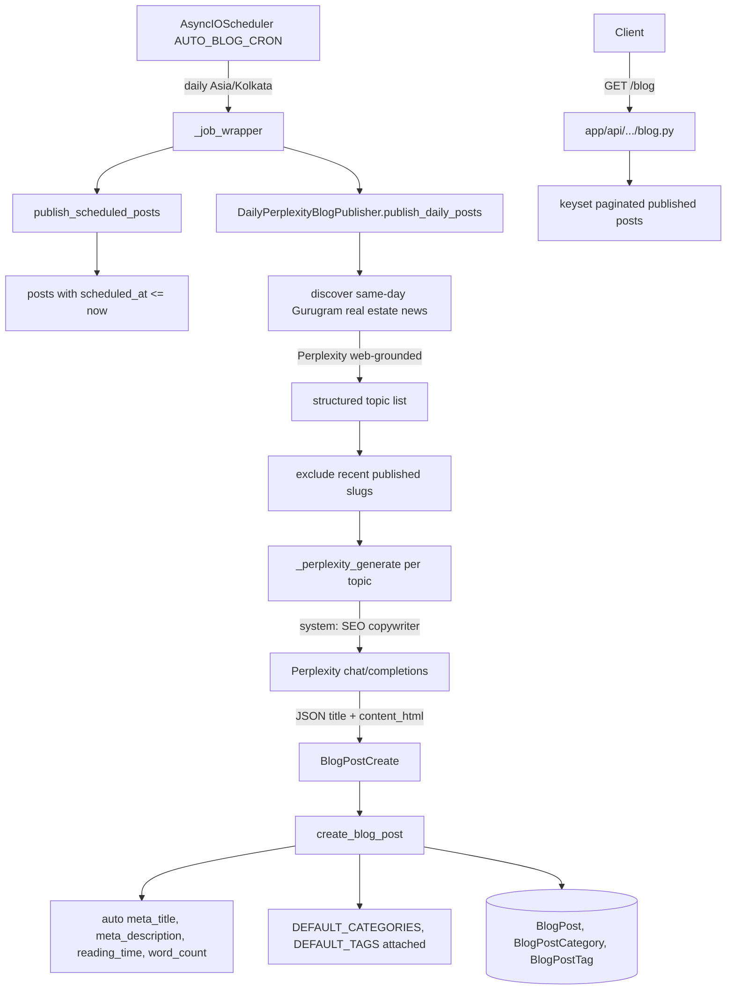

# Blog

Active contributors: Saksham, Ravi

The blog is an AI-generated, SEO-optimised content system for 360 Ghar. Perplexity powers article generation, SEO fields (meta title, meta description, focus keyword, canonical URL, OG image, reading time, word count) are auto-computed from the post body, and a daily APScheduler job discovers fresh Gurugram real estate news, writes full HTML articles, and publishes them with categories and tags.

## Directory layout

```
app/api/api_v1/endpoints/
└── blog.py                # blog post, category, tag CRUD + public read endpoints
app/services/
├── blog.py                # blog post CRUD, SEO helpers, scheduled publish
├── blog_auto_publish.py   # DailyPerplexityBlogPublisher: discover + generate + publish
├── blog_auto_publish_scheduler.py # registers daily cron on shared scheduler
└── blog_service/
    └── generator.py       # _perplexity_generate: Perplexity API call for topic → HTML
app/models/
└── blogs.py               # BlogPost, BlogCategory, BlogTag, BlogPostCategory, BlogPostTag
app/schemas/
└── blog.py                # BlogPostCreate, BlogPostUpdate, BlogSource, BlogSEOMetadata
```

## Key abstractions

| Abstraction | File | Role |
|---|---|---|
| `create_blog_post` | `app/services/blog.py` | Persists post, auto-computes SEO fields, syncs `active` with `status` |
| `_auto_meta_title` | `app/services/blog.py` | Truncates title to 57 chars with ellipsis at word boundary |
| `_auto_meta_description` | `app/services/blog.py` | Builds 157-char description from excerpt or stripped body |
| `_compute_word_count` / `_compute_reading_time` | `app/services/blog.py` | Word count (HTML stripped) and 200 wpm reading time |
| `_serialize_sources` / `_serialize_seo_metadata` | `app/services/blog.py` | Normalises source/SEO objects to JSONB-storable dicts |
| `DailyPerplexityBlogPublisher` | `app/services/blog_auto_publish.py` | Discovers same-day news, generates HTML, dedupes, publishes |
| `_perplexity_generate` | `app/services/blog_service/generator.py` | Calls Perplexity chat completions API with SEO copywriter system prompt |
| `publish_scheduled_posts` | `app/services/blog.py` | Publishes posts whose `scheduled_at` has passed |
| `start_auto_blog_publish_scheduler` | `app/services/blog_auto_publish_scheduler.py` | Registers daily cron job on shared scheduler |
| `BLOG_CATEGORIES` | `app/services/blog_service/generator.py` | 13 content category prompts for the AI copywriter |

## How it works

Manual blog CRUD lives in `app/services/blog.py`. On create or update, SEO fields are auto-computed when not explicitly provided: `_auto_meta_title` truncates the title to 57 chars, `_auto_meta_description` builds a 157-char summary from the excerpt or stripped body, `_compute_word_count` strips HTML tags and counts words, and `_compute_reading_time` divides by 200 wpm (minimum 1). Sources are serialised to a JSONB list of `{url, ...}` dicts and `seo_metadata` to a JSONB dict. The legacy `active` boolean is kept in sync with `status == published`. The `BlogPostStatus` enum (`draft`, `published`, `archived`) drives visibility.



Auto-publish is the more interesting flow. `start_auto_blog_publish_scheduler` registers a single cron job (configurable via `AUTO_BLOG_CRON`, default daily, timezone `AUTO_BLOG_TIMEZONE` defaulting to Asia/Kolkata) on the shared `AsyncIOScheduler` if `AUTO_BLOG_ENABLED` is true. The job wrapper first calls `publish_scheduled_posts` to flip any posts with `scheduled_at <= now` to `published`, then runs `DailyPerplexityBlogPublisher.publish_daily_posts`.

The publisher uses two Perplexity calls. The discovery call uses `DISCOVERY_SYSTEM_PROMPT` (a "automated news desk" persona that returns only same-day real estate and Gurugram stories, excluding recent overlaps and social posts) to surface topics. The generation call uses `GENERATION_SYSTEM_PROMPT` (a "factual real-estate blog writer" persona that produces H2/H3-structured HTML with key takeaways, Gurgaon-specific context, and 360 Ghar value props woven in) to write each article. `BLOCKED_SOURCE_DOMAINS` filters out social media sources; `STOP_WORDS` and `RECENT_POST_LOOKBACK_DAYS` (7) drive deduplication. Each generated post is created via `create_blog_post` with `DEFAULT_CATEGORIES` (`Real Estate`, `Gurugram`, `News`) and `DEFAULT_TAGS`, which attaches `BlogCategory` and `BlogTag` rows through the `BlogPostCategory` and `BlogPostTag` join tables. In serverless mode (`SERVERLESS_ENABLED=True`) the scheduler is skipped and the job must be moved to Railway cron.

## Integration points

- **Scheduler**: the cron job registers on the shared `AsyncIOScheduler` from `app/infrastructure/scheduler.py` (see [infrastructure](../systems/infrastructure.md)).
- **HTTP client**: `_perplexity_generate` uses `get_blog_client()` (120s default timeout) from `app/core/http.py`.
- **Cache**: blog list responses are decorated with `@cached` from the [cache subsystem](../systems/cache-subsystem.md).
- **DB resilience**: list queries go through `execute_with_transient_retry` for transient DB error retry.
- **Serverless**: in serverless mode the scheduler is skipped; auto-publish must run as a Railway cron job.

## Entry points for modification

SEO field computation lives in the `_auto_*` helpers in `app/services/blog.py` — adjust there to change truncation lengths or reading speed. Auto-publish discovery and generation prompts live in `app/services/blog_auto_publish.py` (`DISCOVERY_SYSTEM_PROMPT`, `GENERATION_SYSTEM_PROMPT`); category/tag defaults live in the same file. New blog categories or tags must be created through `BlogCategory` / `BlogTag` rows and attached via the join tables. The Perplexity API integration in `blog_service/generator.py` requires `PERPLEXITY_API_KEY` in settings.

## Key source files

| File | Purpose |
|---|---|
| `app/api/api_v1/endpoints/blog.py` | Blog REST endpoints (21.5 KB) |
| `app/services/blog.py` | Blog service + SEO helpers (930 lines) |
| `app/services/blog_auto_publish.py` | DailyPerplexityBlogPublisher (638 lines) |
| `app/services/blog_auto_publish_scheduler.py` | Cron registration |
| `app/services/blog_service/generator.py` | Perplexity generation (346 lines) |
| `app/models/blogs.py` | BlogPost, BlogCategory, BlogTag, join tables |
| `app/schemas/blog.py` | BlogPostCreate, BlogSource, BlogSEOMetadata |
| `app/models/enums.py` | `BlogPostStatus` |
