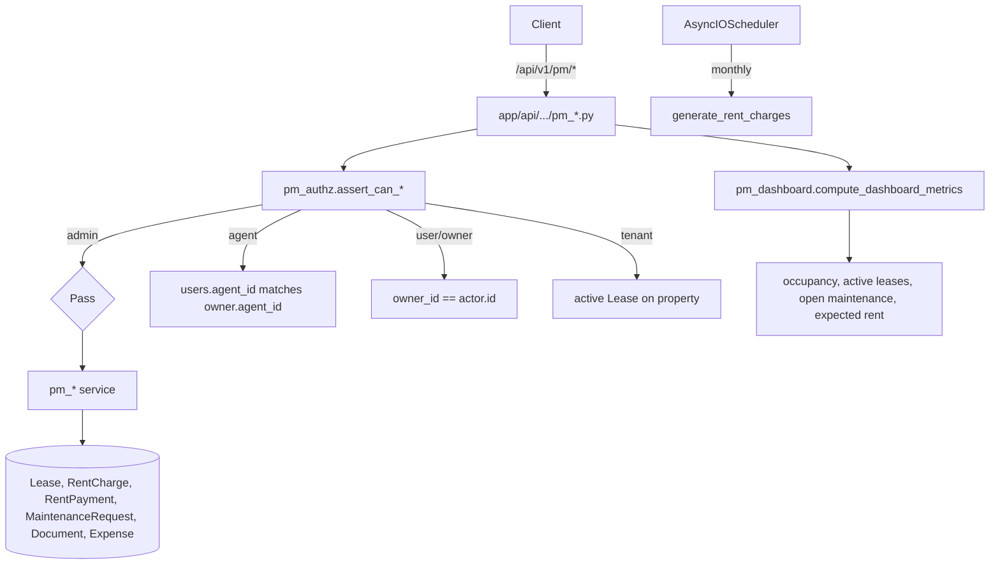

# Property Management

Active contributors: Saksham, Ravi

The Property Management (PM) module is the landlord and relationship-manager surface of 360 Ghar. It manages the full lifecycle of managed properties: leases, rent collection, maintenance requests, documents, inspections, expenses, reports, tenants, rental applications, and RM assignments. Every PM operation flows through a central authorisation layer that enforces owner, agent (RM), tenant, and admin scopes.

## Directory layout

```
app/api/api_v1/endpoints/
├── pm_properties.py       # managed property list, get, dashboard summary
├── pm_leases.py           # lease CRUD, terminate, list
├── pm_rent.py             # generate charges, record payment, due list, history
├── pm_maintenance.py      # maintenance request CRUD, status updates
├── pm_documents.py        # document upload, list, delete
├── pm_inspections.py      # move_in/move_out/routine inspections
├── pm_expenses.py         # expense tracking by category
├── pm_tenants.py          # tenant list, status transitions
├── pm_applications.py     # rental applications + forms
├── pm_assignments.py      # RM (agent) → owner assignments
├── pm_dashboard.py        # portfolio dashboard metrics
└── pm_reports.py          # financial and occupancy reports
app/services/
├── pm_authz.py            # central authorisation layer (assert_can_*)
├── pm_properties.py       # managed property service
├── pm_leases.py           # lease service
├── pm_rent.py             # rent charge generation + payment recording
├── pm_maintenance.py      # maintenance requests + work orders
├── pm_documents.py        # document storage
├── pm_inspections.py      # inspection checklists
├── pm_expenses.py         # expense CRUD
├── pm_tenants.py          # tenant lifecycle
├── pm_applications.py     # rental applications
├── pm_assignments.py      # RM assignments
├── pm_dashboard.py        # dashboard aggregation
└── pm_reports.py          # report generation
app/models/
├── pm_leases.py           # Lease, RentalApplication, RentalApplicationForm
├── pm_finance.py          # RentCharge, RentPayment, Expense
├── pm_maintenance.py      # MaintenanceRequest, WorkOrder
└── pm_documents.py        # Document, InspectionChecklist
```

## Key abstractions

| Abstraction | File | Role |
|---|---|---|
| `assert_can_manage_owner_portfolio` | `app/services/pm_authz.py` | Owner-scope check: admin passes, agent must own the assignment, user must be self |
| `assert_can_access_property` | `app/services/pm_authz.py` | Property-scope check with optional tenant lease lookup |
| `assert_can_access_lease` | `app/services/pm_authz.py` | Lease-scope check resolving tenant, owner, and RM |
| `can_access_booking` | `app/services/pm_authz.py` | Booking-scope check for stays overlap |
| `_get_actor_role` | `app/services/pm_authz.py` | Normalises `UserRole` from model or schema |
| `create_lease` | `app/services/pm_leases.py` | Validates dates, prevents duplicate active leases, persists |
| `generate_rent_charges` | `app/services/pm_rent.py` | Idempotent monthly charge generation for active leases |
| `record_rent_payment` | `app/services/pm_rent.py` | Records `RentPayment`, updates `RentCharge.status` |
| `create_maintenance_request` | `app/services/pm_maintenance.py` | Tenant or owner creates request, optional lease link |

## How it works

Every PM call starts in `pm_authz.py`. The actor is resolved through `_get_actor_role` (handling both `UserRole` enum columns and string schemas) and routed to one of four scope assertions. Admins pass everywhere. Agents must have `agent_id` linked to the owner's `users.agent_id` column (the RM assignment). Owners act on their own portfolio. Tenants are allowed only when `allow_tenant=True` and they hold an active lease on the property.



Lease creation enforces a single active lease per property: `create_lease` queries for `Lease.property_id == property_id AND Lease.status == active` and raises `BadRequestException` if one exists. Lease status transitions go through `draft → pending_signature → active → expiring_soon → expired` (or `terminated` / `renewed`), with `termination_date` and `termination_reason` captured on termination.

Rent collection is idempotent. `generate_rent_charges` accepts a `start_month` and `months` count (1-24), resolves the active-lease scope for the actor, and upserts `RentCharge` rows keyed by `(lease_id, billing_month)`. `record_rent_payment` inserts a `RentPayment`, then recomputes the linked `RentCharge.status` (`pending`, `partial`, `paid`, `overdue`, `waived`) from the sum of payments. Late fees use `late_fee_amount` or `late_fee_percentage` after `grace_period_days` (default 5).

Maintenance requests support the full workflow `open → in_review → work_order_created → resolved → closed`, with linked `WorkOrder` rows carrying `WorkOrderStatus`. Tenants can create requests against properties they lease; owners and RMs manage them. Documents, inspections (move_in/move_out/routine), and expenses are scoped to the same property/lease authorisation.

## Integration points

- **Auth dependencies**: PM endpoints use `get_current_active_user`, `get_current_agent`, and `get_current_admin` from `app/api/api_v1/dependencies/auth.py`.
- **Notifications**: rent due, maintenance status, lease termination, and document approval events flow through [notifications](notifications.md) via `dispatch_notification_to_user`.
- **MCP servers**: the [MCP servers](mcp-servers.md) admin server exposes `agent_*` PM tools; the user server exposes `owner_*` and `tenant_*` PM tools. Shared logic lives in `app/mcp/tool_ops/` (leases, rent, maintenance, dashboard) and `app/mcp/chatgpt/pm_*` modules.
- **AI agent**: the [AI agent](ai-agent.md) registers PM tools for owners, tenants, agents, and admins via `app/services/ai_agent/tools/owner.py` and `tenant.py`.
- **Storage**: document uploads use Cloudinary through the shared [storage](../systems/services-layer.md) service with `DOCUMENT_*` storage folder enums.

## Entry points for modification

New PM operations must go through `pm_authz` — never query `Lease` or `MaintenanceRequest` directly without an `assert_can_access_*` call. New rent charge fields belong in `generate_rent_charges` and the `RentCharge` model; the payment application logic in `record_rent_payment` must be updated to recompute `RentCharge.status`. Status enums live in `app/models/enums.py` and any new value requires a migration plus an enum update in CLAUDE.md.

## Key source files

| File | Purpose |
|---|---|
| `app/services/pm_authz.py` | Central authorisation (260 lines) |
| `app/services/pm_leases.py` | Lease service (280 lines) |
| `app/services/pm_rent.py` | Rent charges + payments (343 lines) |
| `app/services/pm_maintenance.py` | Maintenance + work orders (217 lines) |
| `app/services/pm_dashboard.py` | Dashboard metrics (9.9 KB) |
| `app/services/pm_reports.py` | Financial and occupancy reports |
| `app/services/pm_applications.py` | Rental applications (9 KB) |
| `app/services/pm_properties.py` | Managed property service (8.9 KB) |
| `app/services/pm_documents.py` | Document storage |
| `app/services/pm_inspections.py` | Inspection checklists |
| `app/services/pm_expenses.py` | Expense tracking |
| `app/services/pm_tenants.py` | Tenant lifecycle |
| `app/services/pm_assignments.py` | RM assignments |
| `app/api/api_v1/endpoints/pm_*.py` | 12 endpoint modules |
| `app/mcp/tool_ops/{leases,rent,maintenance,dashboard}.py` | Shared MCP logic |
| `app/mcp/chatgpt/pm_*.py` | ChatGPT-specific PM tool wrappers |
