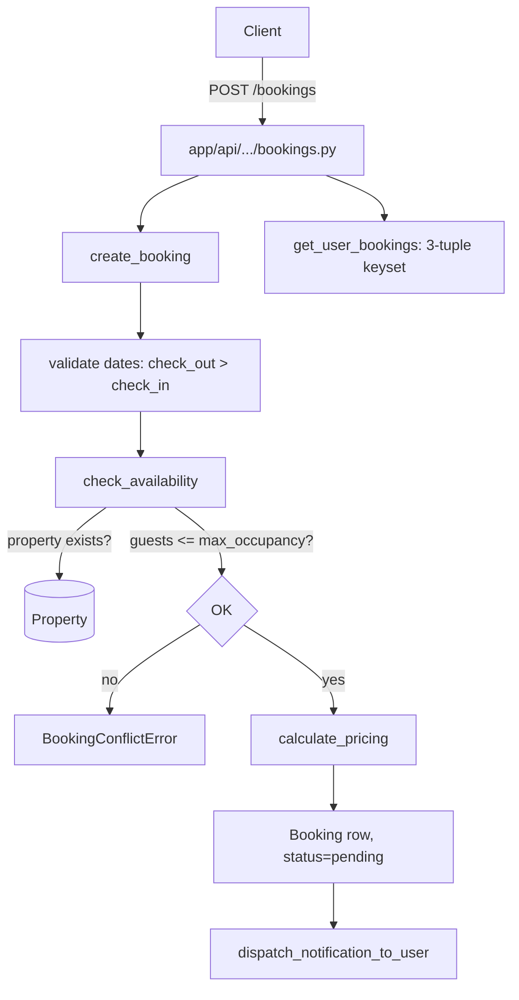

# 360 Stays

Active contributors: Saksham, Ravi

360 Stays is the short-stay booking module: hotels, vacation rentals, and temporary accommodation booked by the night. It covers availability checks, dynamic pricing, the full booking lifecycle from `pending` to `completed`, and the deliberate overlapping-bookings business rule that allows the same property to be booked by multiple guests for the same dates.

## Directory layout

```
app/api/api_v1/endpoints/
└── bookings.py            # create, list, get, update, cancel, review, availability, pricing
app/services/
└── booking.py             # create_booking, check_availability, calculate_pricing, cancel, review
app/models/
└── bookings.py            # Booking ORM model
app/schemas/
└── booking.py             # BookingCreate, BookingUpdate, BookingPayment, BookingReview, BookingAvailability
app/models/enums.py        # BookingStatus, PaymentStatus
```

## Key abstractions

| Abstraction | File | Role |
|---|---|---|
| `create_booking` | `app/services/booking.py` | Validates dates, calls `check_availability` and `calculate_pricing`, persists with `pending` status |
| `check_availability` | `app/services/booking.py` | Verifies property exists and guests fit `max_occupancy`. No date-overlap checks |
| `calculate_pricing` | `app/services/booking.py` | Computes nights, base, taxes, service charges, discount, total |
| `get_user_bookings` | `app/services/booking.py` | Keyset-paginated `(created_at, id)` 3-tuple return |
| `BookingStatus` | `app/models/enums.py` | `pending, confirmed, checked_in, checked_out, cancelled, completed` |
| `can_access_booking` | `app/services/pm_authz.py` | Authorisation for owner/agent/admin to view a booking |
| `booking_reference` | `app/services/booking.py` | `BK` + 8-char hex uuid, generated server-side |

## How it works

Booking creation is a four-step pipeline: validate the date range, call `check_availability`, call `calculate_pricing`, then persist. Each booking gets a server-generated `booking_reference` of the form `BK{8 hex chars}`. Pricing is computed from the property's per-night rate multiplied by the night count, with taxes, service charges, and an optional discount summed into `total_amount`. Both `booking_status` and `payment_status` start as `pending`.



The critical business rule, documented in [CLAUDE.md](../../CLAUDE.md) and [AGENTS.md](../../AGENTS.md), is that **overlapping bookings are allowed**. `check_availability` only verifies the property exists and that the guest count fits `max_occupancy`. There are no date-overlap conflict checks, no double-booking guards, and no DB exclusion constraints on bookings. The same property can be shown to and booked by multiple people for the same or overlapping dates. Do not add such guards without explicit instruction.

`get_user_bookings`, `get_user_upcoming_bookings`, and `get_user_past_bookings` all return the 3-tuple shape `(items, next_payload, total)` using keyset pagination on `(created_at, id)` descending, consistent with the [Ghar Core](ghar-core.md) pagination refactor. Admin and agent access flows through `can_access_booking` in `pm_authz.py`.

## Integration points

- **Notifications**: `bookings.py` endpoint imports `dispatch_notification_to_user` from [notifications](notifications.md) to fire `booking_confirmed` and related events.
- **PM authz**: owner/agent/admin access to a booking is gated by `can_access_booking` in `app/services/pm_authz.py`, which resolves actor role and ownership.
- **MCP servers**: the [MCP servers](mcp-servers.md) `bookings_*` tools in `app/mcp/tool_ops/bookings.py` and `app/mcp/user/booking.py` call the same service functions.
- **Cache**: booking detail responses are not cached; availability checks always hit the DB.

## Entry points for modification

Pricing logic lives entirely in `calculate_pricing` in `app/services/booking.py` — add surcharges, seasonal rates, or length-of-stay discounts there. Status transitions are applied through `update_booking` and `cancel_booking`; never bypass these to mutate `booking_status` directly. New booking-related notifications must be registered in `NOTIFICATION_TYPES` in `app/services/notification_config.py`.

## Key source files

| File | Purpose |
|---|---|
| `app/api/api_v1/endpoints/bookings.py` | REST endpoints (297 lines) |
| `app/services/booking.py` | Booking service (398 lines) |
| `app/models/bookings.py` | Booking ORM model |
| `app/schemas/booking.py` | Request/response schemas |
| `app/services/pm_authz.py` | `can_access_booking` authorisation |
| `app/mcp/tool_ops/bookings.py` | Shared MCP tool logic for bookings |
