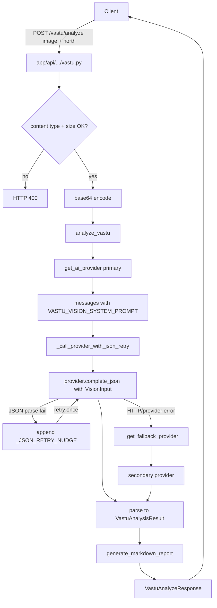

# Vastu

Active contributors: Saksham, Ravi

The Vastu analyzer is a public, AI-powered floor plan compliance checker. Users upload a floor plan image (JPEG, PNG, or WebP up to 5MB), indicate where North points, and receive a comprehensive Vastu Shastra report: an overall score, room-by-room analysis, identified defects with severity, practical remedies, and a markdown report. The analyzer uses the shared AI provider abstraction with automatic JSON-parse retry and provider fallback between Gemini and GLM vision models.

## Directory layout

```
app/api/api_v1/endpoints/
└── vastu.py               # POST /vastu/analyze (public, no auth)
app/services/ai/vastu/
├── __init__.py            # re-exports
├── analyzer.py            # analyze_vastu, _call_provider_with_json_retry, fallback
├── prompts.py             # VASTU_VISION_SYSTEM_PROMPT, get_user_prompt, generate_markdown_report
└── schemas.py             # VastuAnalyzeRequest, VastuAnalyzeResponse, VastuDefect, VastuRemedy, RoomVastuAnalysis
app/services/ai/
├── base.py                # AIProvider ABC, AIMessage, VisionInput
└── providers/             # GeminiProvider, GLMProvider
app/core/constants.py      # DEFAULT_VISION_PROVIDER, VALID_VISION_PROVIDERS, VASTU_FALLBACK_PROVIDER
```

## Key abstractions

| Abstraction | File | Role |
|---|---|---|
| `analyze_vastu` | `app/services/ai/vastu/analyzer.py` | Main entry: builds messages, calls provider with JSON retry + fallback, returns response |
| `_call_provider_with_json_retry` | `app/services/ai/vastu/analyzer.py` | One retry with corrective nudge on JSON parse failure |
| `_get_fallback_provider` | `app/services/ai/vastu/analyzer.py` | Returns the secondary provider name (explicit `VASTU_FALLBACK_PROVIDER` or the other entry in `VALID_VISION_PROVIDERS`) |
| `VASTU_VISION_SYSTEM_PROMPT` | `app/services/ai/vastu/prompts.py` | Combined layout extraction + Vastu analysis prompt with image validation, direction rules, and remedy guidance |
| `get_user_prompt` | `app/services/ai/vastu/prompts.py` | Builds the user message with north direction and notes |
| `generate_markdown_report` | `app/services/ai/vastu/prompts.py` | Renders the structured analysis into a markdown report |
| `VastuAnalyzeRequest` | `app/services/ai/vastu/schemas.py` | `north_direction`, `notes` (max 1000 chars) |
| `VastuAnalyzeResponse` | `app/services/ai/vastu/schemas.py` | Full response: score, status, rooms, defects, remedies, warnings, markdown report |
| `NorthDirection` | `app/services/ai/vastu/schemas.py` | Enum: `up, down, left, right, unknown` |
| `VastuStatus` | `app/services/ai/vastu/schemas.py` | Enum: `excellent, good, neutral, concerning, problematic` |
| `get_ai_provider` | `app/services/ai/__init__.py` | Factory returning Gemini or GLM provider with tenacity retries |

## How it works

The `/vastu/analyze` endpoint accepts a multipart upload: an image file, a `north_direction` form field (default `up`), optional `notes`, and an optional `provider` form field (`gemini` or `glm`, defaulting to `DEFAULT_VISION_PROVIDER`). It validates the content type against `ALLOWED_TYPES` (`image/jpeg`, `image/png`, `image/webp`) and enforces a 5MB max size. The image bytes are base64-encoded and passed to the AI provider as `VisionInput`.



The system prompt in `prompts.py` is the knowledge core. `VASTU_VISION_SYSTEM_PROMPT` instructs the model to first validate that the image is a 2D architectural floor plan (setting `is_valid_floor_plan` false and `analysis_confidence` to 0.1-0.3 if not), then extract the layout (plot shape, rooms, entrance, special features), then apply direction-based Vastu rules covering entrance (best: North, East, NE; avoid: South, SW), kitchen (ideal: SE Agni corner), master bedroom (ideal: SW), toilets (avoid NE and center/Brahmasthan), living room, and staircase placement. The prompt enumerates core principles, remedy types (placement, color, element, structural), and warning types (not a floor plan, missing rooms, low image quality, ambiguous directions).

Robustness is layered. The AI provider abstraction in `app/services/ai/base.py` wraps HTTP calls with tenacity retries. `_call_provider_with_json_retry` catches `AIProviderError` containing "Failed to parse JSON" and retries once with `_JSON_RETRY_NUDGE` appended to the last user message, instructing the model to return only valid JSON without markdown fences. If the primary provider fails entirely, `_get_fallback_provider` returns the secondary (explicit `VASTU_FALLBACK_PROVIDER` if set and different, otherwise the other entry in `VALID_VISION_PROVIDERS`) and the call is retried against the fallback.

The response is a `VastuAnalyzeResponse` containing an overall `score` (1-10), `status` (`VastuStatus`), `analysis_confidence`, `is_valid_floor_plan`, lists of `RoomVastuAnalysis` (per-room status), `VastuDefect` (with `DefectSeverity`), `VastuRemedy` (with `RemedyType`), `AnalysisWarning` (with `AnalysisWarningType` and `AnalysisWarningSeverity`), a parsed `FloorPlanAnalysis`, and the full `markdown_report` rendered by `generate_markdown_report`.

## Integration points

- **AI providers**: vastu uses `get_ai_provider` from `app/services/ai/` with the Gemini and GLM vision providers, sharing the same abstraction as [tour AI](virtual-tours.md) and other vision features.
- **Constants**: `DEFAULT_VISION_PROVIDER`, `VALID_VISION_PROVIDERS`, and `VASTU_FALLBACK_PROVIDER` in `app/core/constants.py` control provider selection.
- **Auth**: the endpoint is public — no `get_current_user` dependency. Rate limiting is handled by the global 500 req/min per-IP sliding window.
- **Storage**: vastu does not persist uploaded images or analysis results; it is a stateless request-response service.

## Entry points for modification

Vastu rules and prompt engineering live in `app/services/ai/vastu/prompts.py` — extend `VASTU_VISION_SYSTEM_PROMPT` to add rules or remedy types. Response shape changes require updating the Pydantic schemas in `schemas.py` and the markdown renderer in `generate_markdown_report`. New AI providers must be added to `VALID_VISION_PROVIDERS` in `app/core/constants.py` and implemented in `app/services/ai/providers/`. The fallback logic in `_get_fallback_provider` automatically picks up any new provider in the valid list.

## Key source files

| File | Purpose |
|---|---|
| `app/api/api_v1/endpoints/vastu.py` | Public analyze endpoint (151 lines) |
| `app/services/ai/vastu/analyzer.py` | Main analysis logic (532 lines) |
| `app/services/ai/vastu/prompts.py` | System prompt + knowledge base + markdown report (330 lines) |
| `app/services/ai/vastu/schemas.py` | Request/response Pydantic schemas (230 lines) |
| `app/services/ai/base.py` | AIProvider ABC, AIMessage, VisionInput |
| `app/services/ai/providers/` | GeminiProvider, GLMProvider |
| `app/core/constants.py` | Vision provider defaults and fallback config |
