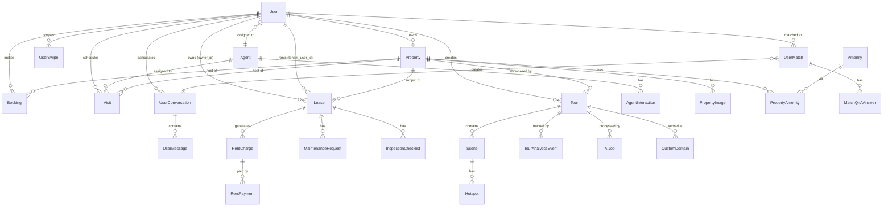

# Data models

The 360Ghar backend has 68 ORM tables across 18 model files, plus 50+ enums in `app/models/enums.py`. This page maps the model inventory, the relationships between key entities, and the conventions that hold it all together.

Active contributors: Saksham, Ravi

## Model files

| File | Tables |
|---|---|
| `app/models/users.py` | `User`, `UserSearchHistory`, `UserSwipe` |
| `app/models/agents.py` | `Agent`, `AgentInteraction` |
| `app/models/properties.py` | `Property`, `PropertyImage`, `Amenity`, `PropertyAmenity`, `Visit` |
| `app/models/bookings.py` | `Booking` |
| `app/models/payments.py` | `PaymentMethod` |
| `app/models/core.py` | `BugReport`, `Page`, `AppVersion`, `FAQ` |
| `app/models/blogs.py` | `BlogPost`, `BlogCategory`, `BlogTag`, `BlogPostCategory`, `BlogPostTag` |
| `app/models/social.py` | `UserMatch`, `UserConversation`, `UserMessage`, `UserBlock`, `UserReport`, `AppCatalog`, `MatchQnAAnswer`, `FlatmateProfileViewEvent`, `FlatmateSuperLikeUsage` |
| `app/models/tours.py` | `Tour`, `Scene`, `Hotspot`, `TourAnalyticsEvent`, `AIJob`, `MediaFile`, `UserSession`, `TourLocation`, `SearchIndex`, `CacheEntry`, `FloorPlan`, `TourBranding`, `CustomDomain`, `VideoMetadata` |
| `app/models/pm_leases.py` | `Lease` |
| `app/models/pm_tenants.py` | `RentalApplication`, `RentalApplicationForm` |
| `app/models/pm_finance.py` | `RentCharge`, `RentPayment`, `Expense` |
| `app/models/pm_maintenance.py` | `MaintenanceRequest` |
| `app/models/pm_documents.py` | `Document` |
| `app/models/pm_inspections.py` | `InspectionChecklist` |
| `app/models/ai_conversations.py` | `AIConversation`, `AIConversationMessage` |
| `app/models/data_hub.py` | `BankAuction`, `CircleRate`, `CourtAuction`, `GazetteNotification`, `JamabandiCache`, `ReraProject`, `ReraComplaint`, `ZoningData`, `ColonyApproval`, `NeighbourhoodScore`, `BankRate`, `AuctionAlert`, `ScraperRun` |

## Enums

`app/models/enums.py` (563 lines) defines 50+ string enums, all inheriting from `(str, Enum)`. They are stored as `SQLEnum` columns with DB-level `CHECK` constraints. Notable families:

- **Property**: `PropertyType`, `PropertyPurpose`, `PropertyStatus`, `ImageCategory`, `ManagedPropertyStatus`
- **Booking/Visit**: `BookingStatus`, `PaymentStatus`, `VisitStatus`, `VisitContext`
- **Flatmates/Social**: `FlatmatesMode`, `FlatmatesProfileStatus`, `SwipeAction`, `SwipeTargetType`, `ConversationSource`, `ConversationStatus`, `UserMatchStatus`, `MessageType`, `ListingGenderPreference`, `ListingSharingType`, `UserReportReason`, `UserReportStatus`, `ListingModerationStatus`, `ModerationAction`, `ReportAction`
- **PM**: `LeaseStatus`, `TenantStatus`, `RentChargeStatus`, `ExpenseCategory`, `MaintenanceCategory`, `MaintenanceUrgency`, `MaintenanceRequestStatus`, `WorkOrderStatus`, `DocumentType`, `InspectionType`
- **Tours**: `TourStatus`, `TourVisibility`, `HotspotType`, `AIJobStatus`, `AIJobType`, `CustomDomainVerificationStatus`, `CustomDomainSSLStatus`
- **Data Hub**: `ScraperStatus`, `AuctionSource`, `GazetteType`, `ComplaintNature`
- **Identity**: `UserRole`, `AuthMethod`, `AgentType`, `ExperienceLevel`, `AgentInteractionType`

The `PG_FLATMATE_TYPES` constant `{PropertyType.pg, PropertyType.flatmate}` marks property types routed through the Flatmates module.

## Entity relationship diagram

## Conventions

- **Base class**: all models inherit from `app.core.database.Base`.
- **Primary keys**: integer auto-incrementing for most tables; UUID strings for tour-related tables (`Tour`, `Scene`, `Hotspot`, `AIJob`, etc.) via `generate_uuid()`.
- **Timestamps**: `created_at` with `server_default=func.now()`, `updated_at` with `onupdate=func.now()`. Both `DateTime(timezone=True)`.
- **Foreign keys**: `ON DELETE CASCADE` for ownership edges (user -> property -> visit). `ON DELETE SET NULL` for soft edges (agent assigned to a visit, tenant user on a lease). `ON DELETE RESTRICT` (default) where referential integrity must block deletion.
- **Enums**: `SQLEnum` columns with DB-level `CHECK` constraints. Some columns (e.g. `Visit.visit_context`) are stored as `String` with a CHECK constraint rather than `SQLEnum` for forward compatibility, typed via the enum at the Python layer.
- **Geospatial**: `Geography(Point, 4326)` from GeoAlchemy2 for the `Property` location. SQLite compile shims in `app/models/properties.py` make `Base.metadata.create_all` work in tests.
- **Full-text search**: a `tsvector` column `__ts_vector__` on `properties`, with indexes created by migrations.
- **Vector embeddings**: a separate `property_embeddings` table (pgvector) rather than a column on `properties`, synced by `app/vector/`.

## Seed data flag

The `is_seed_data` boolean column (default `false`, `server_default=text("false")`) exists on `users`, `agents`, and `properties`. Child tables do not have their own flag - they inherit "seedness" through FK joins to their parent. The `seed_data/02_clear_data.py` script uses this to scope deletions. See [background/pitfalls.md](../background/pitfalls.md).

## Migrations

SQL migrations live in `supabase/migrations/`. They are applied via `supabase db push` or `supabase db reset`. Lightweight DDL that cannot go through the Supabase CLI (enum value additions, column adds) is applied at startup by the lifespan - see [deployment.md](../deployment.md).
