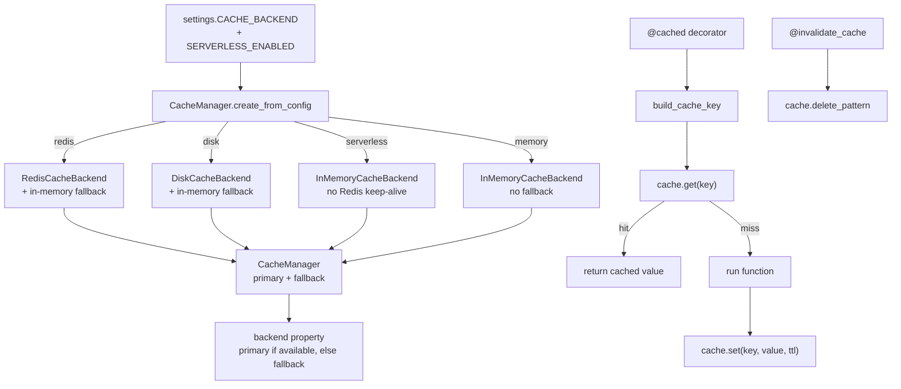

# Cache subsystem

Active contributors: Saksham, Ravi

The cache subsystem provides a unified, backend-agnostic caching layer under `app/core/cache/`. It supports three pluggable backends (Redis, in-memory LRU, disk), a `CacheManager` facade that handles backend selection and graceful fallback, decorators for transparent function-level caching, consistent key generation, and a `PropertyCacheManager` specialized for property queries. The subsystem is wired into app startup and shutdown through `initialize_cache()` / `shutdown_cache()` in lifespan.

## Directory layout

```
app/core/cache/
├── __init__.py            # Public API, global manager, PropertyCacheManager
├── interface.py           # CacheBackend Protocol, CacheStats dataclass
├── manager.py             # CacheManager facade, CacheBackendType, NullCacheBackend
├── decorators.py          # @cached, @invalidate_cache
├── keys.py                # build_cache_key, generate_hash, CacheKeyPatterns
└── backends/
    ├── __init__.py        # Exports the three backends
    ├── redis.py           # RedisCacheBackend (JSON + pickle fallback, SCAN invalidation)
    ├── memory.py          # InMemoryCacheBackend (LRU OrderedDict, TTL)
    └── disk.py            # DiskCacheBackend (in-memory index + pickle files)
```

## Key abstractions

| Abstraction | Location | Purpose |
|---|---|---|
| `CacheBackend` Protocol | `app/core/cache/interface.py` | Structural typing for backends (`get`, `set`, `get_and_delete`, `delete`, `delete_pattern`, `exists`, `clear`, `connect`, `disconnect`, `is_available`) |
| `CacheManager` | `app/core/cache/manager.py` | Facade over primary + fallback backends, delegates to active backend |
| `NullCacheBackend` | `app/core/cache/manager.py` | No-op backend for graceful degradation when caching is disabled |
| `CacheBackendType` | `app/core/cache/manager.py` | Enum: `disk`, `memory`, `redis` |
| `@cached(prefix, ttl, ...)` | `app/core/cache/decorators.py` | Cache async function results by args/kwargs |
| `@invalidate_cache(patterns)` | `app/core/cache/decorators.py` | Delete matching keys after a function runs |
| `build_cache_key` / `generate_hash` | `app/core/cache/keys.py` | Consistent colon-joined keys with MD5 hash of kwargs |
| `CacheKeyPatterns` | `app/core/cache/keys.py` | Standard invalidation patterns (`properties:*`, `property:{id}:*`, etc.) |
| `PropertyCacheManager` | `app/core/cache/__init__.py` | Property-specific helpers (search keys, detail keys, invalidation) |
| `get_cache_manager` / `initialize_cache` / `shutdown_cache` | `app/core/cache/__init__.py` | Global singleton lifecycle |

## How it works



### Backend selection

`CacheManager.create_from_config(settings)` picks the backend. When `SERVERLESS_ENABLED` is true it forces `InMemoryCacheBackend` so no persistent Redis keep-alive packets prevent Railway scale-to-zero. Otherwise it reads `CACHE_BACKEND` (default `disk`): `redis` uses `RedisCacheBackend` with an `InMemoryCacheBackend` fallback, `disk` uses `DiskCacheBackend` with an in-memory fallback, and `memory` uses in-memory with no fallback. The fallback is wired so a Redis outage degrades to in-memory rather than failing requests.

The `CacheManager` exposes a `backend` property that returns the primary if it `is_available()`, otherwise the fallback. `connect()` tries the primary and flips `_use_fallback` if it fails; `disconnect()` closes both. All operations (`get`, `set`, `get_and_delete`, `delete`, `delete_pattern`, `exists`, `clear`) delegate to the active backend.

### Backends

- **`RedisCacheBackend`** — JSON serialization with pickle fallback for non-JSON-serializable values, connection pooling, pattern-based invalidation via `SCAN` (non-blocking), graceful degradation on connection issues. Uses a configurable `key_prefix` (default `ghar360:`).
- **`InMemoryCacheBackend`** — Thread-safe LRU `OrderedDict` with TTL, `asyncio.Lock` for safety, `fnmatch` for pattern deletion, and `CacheStats` tracking. Bounded by `max_size` and `max_entry_bytes`.
- **`DiskCacheBackend`** — In-memory metadata index (`OrderedDict` of `DiskCacheEntry`) plus pickle files on disk under `CACHE_DISK_DIR`. Hashed filenames, size accounting, TTL expiry.

### Decorators

`@cached(prefix, ttl=300, key_params=None, include_user=False, cache_none=False, condition=None)` wraps an async function. It builds a cache key from the prefix, optional user id, and either the specified `key_params` or all serializable kwargs (excluding `db`, `current_user`, `request`, `session`). On a hit it returns the cached value; on a miss it runs the function, optionally caches the result (skipping `None` unless `cache_none`, and respecting an optional `condition` callable), and serializes Pydantic models via `model_dump(mode="json")` before storage. Cache errors are logged as warnings and never propagate — a cache failure falls through to the function.

`@invalidate_cache(patterns)` runs the function first, then deletes all keys matching the given pattern(s) via `cache.delete_pattern`. Used on mutations to evict stale entries.

### Keys

`build_cache_key(prefix, *args, include_user=False, user_id=None, **kwargs)` joins colon-separated parts: prefix, positional args, optional `u{user_id}`, and an MD5 hash of the filtered kwargs. `generate_hash` serializes dicts with `sort_keys=True` for deterministic hashing. `CacheKeyPatterns` defines standard invalidation patterns and helpers like `for_property(id)` and `for_user(id)`.

### PropertyCacheManager

`PropertyCacheManager` (defined in `app/core/cache/__init__.py`) provides property-specific helpers: `generate_cache_key(filters, user_id, page, limit)` produces `properties:v1:{filter_hash}:u{user_id}:p{page}:l{limit}`, `detail_cache_key(id)` produces `property:{id}:v1`, and `invalidate_property_caches` / `invalidate_property_detail_cache` delete the relevant patterns. Services in `app/services/property/` use these to cache list and detail responses and invalidate on create/update/delete.

## Integration points

- **Lifespan** calls `initialize_cache()` at startup and `shutdown_cache()` at teardown. See [infrastructure](infrastructure.md).
- **Property services** use `PropertyCacheManager` and the `@cached` decorator. See [services-layer](services-layer.md).
- **OAuth token store** (`app/services/oauth_token_store.py`) uses `CacheManager.get_and_delete` for atomic token/code exchange. See [features/mcp-servers](../features/mcp-servers.md).
- **Serverless mode** forces in-memory cache to allow scale-to-zero. See [core-cross-cutting](core-cross-cutting.md).

## Entry points for modification

- New cached query: add `@cached("prefix", ttl=...)` to the service function, choosing `key_params` carefully to avoid cross-user leakage.
- New invalidation pattern: add it to `CacheKeyPatterns` and call `@invalidate_cache` on the mutating function.
- New backend: implement the `CacheBackend` protocol and add a branch in `CacheManager.create_from_config`.

## Key source files

| File | Role |
|---|---|
| `app/core/cache/__init__.py` | Public API, global manager, `PropertyCacheManager` |
| `app/core/cache/interface.py` | `CacheBackend` protocol, `CacheStats` |
| `app/core/cache/manager.py` | `CacheManager` facade, `NullCacheBackend`, backend factory |
| `app/core/cache/decorators.py` | `@cached`, `@invalidate_cache` |
| `app/core/cache/keys.py` | Key generation and patterns |
| `app/core/cache/backends/redis.py` | Redis backend |
| `app/core/cache/backends/memory.py` | In-memory LRU backend |
| `app/core/cache/backends/disk.py` | Disk-backed backend |
