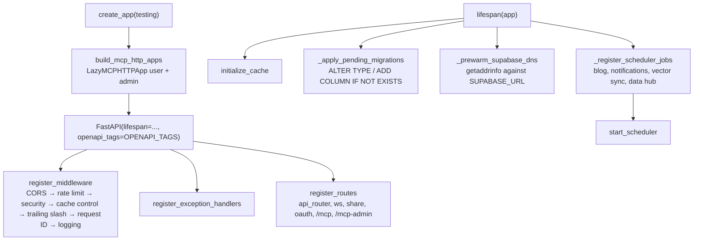

# Infrastructure wiring

Active contributors: Saksham, Ravi

The infrastructure layer is the composition root: it builds the FastAPI app, wires lifespan startup and shutdown, registers middleware, exception handlers, and routes, constructs the two MCP HTTP sub-apps, and owns the shared APScheduler singleton. `app/factory.py` is a thin entry point that delegates to `app/infrastructure/`. Everything that needs to happen once at process start (or once at process end) lives here.

## Directory layout

```
app/
├── factory.py                      # Thin composition root (create_app)
├── infrastructure/
│   ├── lifespan.py                 # Startup/shutdown orchestration
│   ├── middleware.py              # Middleware registration
│   ├── errors.py                  # Exception handlers
│   ├── mcp.py                     # MCP HTTP app construction (lazy)
│   ├── routing.py                 # Route and mount registration
│   ├── scheduler.py               # Shared AsyncIOScheduler singleton
│   └── request_context.py         # Re-export of request ID helpers from core/logging
└── middleware/
    ├── security.py                # SecurityHeaders, RequestID, RequestLogging
    ├── rate_limit.py              # RateLimitMiddleware + EndpointRateLimiter
    ├── cache_control.py           # CacheControlMiddleware
    └── trailing_slash.py          # StripTrailingSlashMiddleware
```

## Key abstractions

| Abstraction | Location | Purpose |
|---|---|---|
| `create_app(testing)` | `app/factory.py` | Builds the FastAPI instance, OpenAPI tags, lifespan, middleware, MCP apps |
| `create_lifespan(testing, user_mcp_app, admin_mcp_app)` | `app/infrastructure/lifespan.py` | Returns the FastAPI lifespan context manager |
| `register_middleware(app, testing)` | `app/infrastructure/middleware.py` | Adds CORS, rate limit, security, cache control, trailing slash, request ID, request logging |
| `register_exception_handlers(app)` | `app/infrastructure/errors.py` | Registers handlers for 401, 403, `BaseAPIException`, `HTTPException`, `ValueError`, `Exception` |
| `register_routes(app, user_mcp_app, admin_mcp_app)` | `app/infrastructure/routing.py` | Mounts REST, WS, share, OAuth well-known, MCP apps |
| `build_mcp_http_apps()` | `app/infrastructure/mcp.py` | Returns lazy user/admin MCP ASGI proxies |
| `get_scheduler()` / `start_scheduler()` / `shutdown_scheduler()` | `app/infrastructure/scheduler.py` | Shared `AsyncIOScheduler` singleton |

## How it works

### Startup



The lifespan context manager wraps the inner MCP app lifespans. When not in testing mode, startup runs four steps in order: initialize the cache, apply lightweight one-off DDL that cannot go through Supabase CLI migrations (enum value adds, column adds), prewarm Supabase DNS by resolving `SUPABASE_URL` once so misconfigured DNS surfaces in startup logs, and register scheduler jobs on the shared `AsyncIOScheduler` before starting it. In serverless mode (`SERVERLESS_ENABLED=True`), scheduler registration is skipped to allow scale-to-zero.

The startup migrations are idempotent `ALTER TYPE ... ADD VALUE IF NOT EXISTS` and `ALTER TABLE ... ADD COLUMN IF NOT EXISTS` statements for changes that the Supabase CLI migration workflow cannot apply (Postgres enum extension is one example). Each statement is wrapped in a try/except that logs a warning on failure without blocking startup.

### Shutdown

Shutdown runs in reverse: stop the scheduler, close cached AI provider HTTP clients, close the FCM and SMS shared clients, close all shared httpx clients (`app/core/http.close_all_clients`), shut down the notification thread pool, disconnect the cache, and dispose both DB engines (main and background). Each step is wrapped in a try/except so a failure in one shutdown step does not prevent the rest from running.

### Middleware

Middleware is registered in a specific order because Starlette executes middleware in reverse registration order (bottom-up). CORS is outermost (first inbound, last outbound). Inside CORS sits the rate limiter (500 req/min per IP global, with tighter per-route limits via `EndpointRateLimiter`). Innermost are the security headers, cache control, trailing slash, request ID, and request logging middleware. In development or testing mode CORS allows `*` without credentials; in production it uses `settings.CORS_ORIGINS` with credentials.

### Exception handlers

`register_exception_handlers` installs handlers for 401 and 403 that add `WWW-Authenticate: Bearer resource_metadata=...` headers on MCP routes (so MCP hosts trigger OAuth), a `BaseAPIException` handler that emits the standardized `{error: {code, message, details}}` shape, an `HTTPException` handler that preserves OAuth error payloads, a `ValueError` handler (422), and a catch-all `Exception` handler that logs to Sentry and returns a generic 500 (leaking the exception string only when `DEBUG` is on).

### MCP HTTP apps

`build_mcp_http_apps` returns two `LazyMCPHTTPApp` instances. These are ASGI proxies that build the concrete MCP app on first request, so the heavy `mcp` and widget registration imports stay off the app import path. The concrete builder registers ChatGPT widgets, wires `BearerAuthBackend` with the `SupabaseTokenVerifier` (requiring `mcp:read` and `mcp:write` scopes), and creates the FastMCP HTTP app with `stateless_http=True`. The inner MCP lifespans are entered when the parent app lifespan runs.

### Shared scheduler

`app/infrastructure/scheduler.py` holds a single module-level `_scheduler` (an `AsyncIOScheduler` with timezone `Asia/Kolkata`). `get_scheduler()` creates it lazily, `start_scheduler()` starts it once, and `shutdown_scheduler()` stops and clears it. All background jobs (blog auto-publish, notifications, vector sync, data hub scrapers) register on this one instance via their `start_*_scheduler` functions, which are called from `_register_scheduler_jobs` in lifespan. No module creates its own scheduler.

## Integration points

- **Core** supplies the cache, DB engines, HTTP clients, and logging that lifespan initializes and shuts down. See [core-cross-cutting](core-cross-cutting.md).
- **Services** register schedulers via `start_*_scheduler` functions called from lifespan. See [services-layer](services-layer.md).
- **MCP servers** are mounted by `register_routes` and lazily built by `build_mcp_http_apps`. See [features/mcp-servers](../features/mcp-servers.md).
- **Middleware** in `app/middleware/` is registered by `register_middleware`.

## Entry points for modification

- New middleware: implement it in `app/middleware/`, add it in `register_middleware` at the right position (remember execution is reverse-order).
- New background job: write a `start_*_scheduler(app)` function that calls `get_scheduler().add_job(...)`, then call it from `_register_scheduler_jobs` in `app/infrastructure/lifespan.py`.
- New startup migration: add a `(label, sql)` tuple to `_apply_pending_migrations`.
- New exception shape: subclass `BaseAPIException` in `app/core/exceptions.py`; the existing handler will serialize it.

## Key source files

| File | Role |
|---|---|
| `app/factory.py` | App factory, OpenAPI tags |
| `app/infrastructure/lifespan.py` | Startup/shutdown orchestration, startup migrations, DNS prewarm |
| `app/infrastructure/middleware.py` | Middleware registration order |
| `app/infrastructure/errors.py` | Exception handlers, MCP `WWW-Authenticate` injection |
| `app/infrastructure/mcp.py` | Lazy MCP HTTP app construction |
| `app/infrastructure/routing.py` | REST, WS, share, OAuth, MCP mounts |
| `app/infrastructure/scheduler.py` | Shared `AsyncIOScheduler` singleton |
| `app/middleware/security.py` | Security headers, request ID, request logging |
| `app/middleware/rate_limit.py` | Global + per-route rate limiting |
