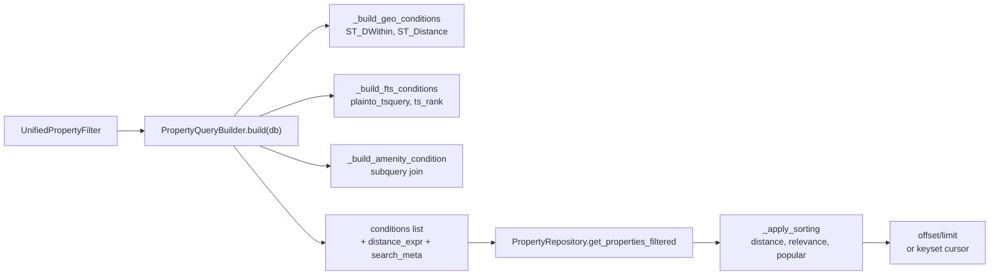

# Repositories

Active contributors: Saksham, Ravi

The repository layer separates data access from business logic. It is intentionally small: three files under `app/repositories/`. Most services query the ORM directly through the injected `AsyncSession`, but property search is complex enough (geospatial filters, full-text search, amenity joins, multi-axis sorting, cursor pagination) to warrant a dedicated repository and a query builder that eliminates duplicated filter/sort logic across property, swipe, and search paths.

## Directory layout

```
app/repositories/
├── base.py                    # BaseRepository[T] generic CRUD
├── property_repository.py     # PropertyRepository: filtered listing, radius, count, sorting
└── property_query_builder.py  # PropertyQueryBuilder: where-clauses from UnifiedPropertyFilter
```

## Key abstractions

| Abstraction | Location | Purpose |
|---|---|---|
| `BaseRepository[T]` | `app/repositories/base.py` | Generic CRUD: `get`, `get_with_relations`, `list`, `count`, `create`, `update`, `delete`, `exists` |
| `PropertyRepository` | `app/repositories/property_repository.py` | Property-specific queries with geospatial, filter, sort helpers |
| `PropertyQueryBuilder` | `app/repositories/property_query_builder.py` | Builds `(conditions, distance_expr, search_meta)` from a `UnifiedPropertyFilter` |
| `SortBy` enum | `app/schemas/property.py` | price_low, price_high, newest, popular, distance, relevance |

## How it works



`BaseRepository` is generic over a SQLAlchemy model. It owns `get`, `get_with_relations` (eager loads via `selectinload`), `list` (dict filters, offset/limit, order by with `-` prefix for descending), `count`, `create` (flush + refresh), `update` (returning), `delete`, and `exists`. Services that only need simple per-model CRUD can subclass it directly.

`PropertyRepository` extends `BaseRepository[Property]` and adds:

- `get_property_with_owner` — eager loads images, owner, and amenities.
- `get_properties_filtered` — applies geo, filters, sorting, pagination. Pops `latitude`/`longitude`/`radius_km` from the filter dict and builds an `ST_SetSRID(ST_MakePoint(...), 4326)` center point, then `ST_DWithin` for radius and `ST_Distance` for ordering.
- `get_properties_within_radius` — convenience wrapper that orders by distance.
- `count_filtered` — count query using the same filter logic.
- `_apply_filters` — price range, bedrooms/bathrooms (>=), and dynamic `hasattr` equality.
- `_apply_sorting` — maps `SortBy` to order expressions, with `distance_expr` and `relevance_expr` injected by the caller.

`PropertyQueryBuilder` is the modern entry point. Its `build(db, include_unavailable=False)` method returns a tuple of `(conditions, distance_expr, search_meta)`. It handles availability, geo, full-text search (with `ts_rank`), property IDs, type, purpose, price, bedrooms, bathrooms, area, city/locality/pincode, parking, floor, age, amenities (subquery with `HAVING count >= len`), features, gender preference, sharing type, and guests. Its `apply_sort` method handles distance, price, newest, popular, and relevance (with optional `combined_relevance_expr` for hybrid vector+text scoring). The builder is reused by property, swipe, and search services to keep filter/sort logic in one place.

## Integration points

- **Property services** in `app/services/property/` use `PropertyQueryBuilder` and `PropertyRepository`. See [services-layer](services-layer.md) and [features/ghar-core](../features/ghar-core.md).
- **Semantic search** layers a vector similarity score on top of the builder's `text_rank_expr` via `combined_relevance_expr`. See [vector-search](vector-search.md).
- **Models** — the repository targets `Property`, `PropertyAmenity`, and `Amenity`. See [models](models.md).

## Entry points for modification

- New filter dimension: add a field to `UnifiedPropertyFilter` and a condition branch in `PropertyQueryBuilder.build`.
- New sort option: add a `SortBy` variant and a branch in `apply_sort` (and the legacy `_apply_sorting` on the repository).
- New model that needs generic CRUD: subclass `BaseRepository[T]`.

## Key source files

| File | Role |
|---|---|
| `app/repositories/base.py` | Generic CRUD base |
| `app/repositories/property_repository.py` | Property repository with geo/filter/sort |
| `app/repositories/property_query_builder.py` | Centralized filter/sort builder |
