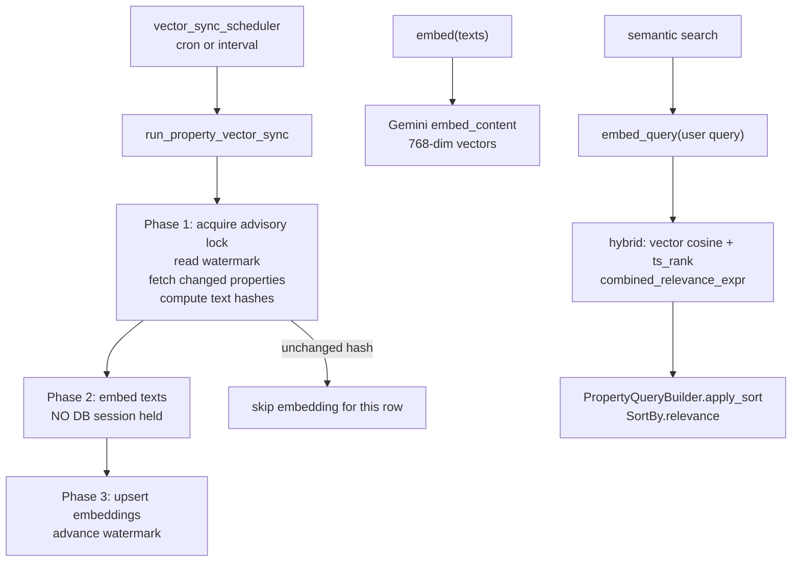

# Vector search

Active contributors: Saksham, Ravi

Vector search powers semantic property recommendations on top of pgvector. Property listings are embedded with Google's Gemini embedding model and stored in a `property_embeddings` table; the search layer blends vector similarity with PostgreSQL full-text ranking to produce a hybrid relevance score. A scheduler keeps embeddings in sync with property changes, and a backfill script can rebuild the index from scratch.

## Directory layout

```
app/vector/
├── store.py              # DB operations: upsert, watermark, advisory lock, hash
├── sync.py               # run_property_vector_sync: incremental sync pipeline
├── compose.py            # build_embedding_text, build_metadata
├── embedding_client.py   # Gemini embed/embed_query wrappers
└── backfill.py           # CLI entry point for a one-off backfill

app/services/
└── vector_sync_scheduler.py  # Registers the sync job on the shared scheduler
```

## Key abstractions

| Abstraction | Location | Purpose |
|---|---|---|
| `property_embeddings` table | managed via raw SQL in `store.py` | Stores `(property_id, embedding, metadata, emb_text_hash, created_at, updated_at)` |
| `vector_sync_state` table | `store.py` | Holds the `last_watermark` for incremental sync |
| `compute_text_hash` | `app/vector/store.py` | SHA-256 of the embedding text; skip re-embedding when unchanged |
| `build_embedding_text` | `app/vector/compose.py` | Canonical text from title, type, location, numbers, description, amenities, tags |
| `build_metadata` | `app/vector/compose.py` | JSON metadata stored alongside the embedding |
| `embed` / `embed_query` | `app/vector/embedding_client.py` | Gemini `embed_content` with `retrieval_document` / `retrieval_query` task types |
| `run_property_vector_sync` | `app/vector/sync.py` | Three-phase incremental sync pipeline |
| `acquire_advisory_lock` | `app/vector/store.py` | `pg_try_advisory_lock` to prevent concurrent sync workers |

## How it works



The sync pipeline is split into three phases so the DB session is released during the network-bound embedding call. Phase 1 acquires a Postgres advisory lock (`pg_try_advisory_lock(hashtext('property_vector_sync'))`), reads the watermark from `vector_sync_state`, fetches changed properties (only the columns consumed by `build_embedding_text`), computes the canonical embedding text and its SHA-256 hash, and compares against the stored `emb_text_hash` to decide which rows actually need re-embedding. If no rows changed, the lock is released and the run returns early.

Phase 2 calls the Gemini embedding API with only the texts whose hash changed. This happens with no DB session held, so the Supabase pooler connection is not held during the network I/O. The embedding client uses `google-genai` with retries (`VECTOR_SYNC_MAX_RETRIES`, exponential backoff) and runs the sync call in a thread executor to avoid blocking the event loop.

Phase 3 opens a fresh background-pool session, upserts embeddings (using a pgvector literal `CAST(:emb AS vector)` and `ON CONFLICT (property_id) DO UPDATE`), advances the watermark to the max `updated_at` (or `created_at` fallback) of the batch, and commits.

At query time, semantic search embeds the user query with `embed_query` (task type `retrieval_query`), computes cosine similarity against `property_embeddings.embedding`, and combines it with the `ts_rank` from `PropertyQueryBuilder`'s full-text search into a `combined_relevance_expr`. The builder's `apply_sort(sort_by=SortBy.relevance, combined_relevance_expr=...)` then orders by that hybrid score. See [repositories](repositories.md).

The scheduler in `app/services/vector_sync_scheduler.py` is gated by `VECTOR_SYNC_ENABLED`. If `VECTOR_SYNC_CRON` is set it uses a `CronTrigger`; otherwise it falls back to an `IntervalTrigger` with `VECTOR_SYNC_INTERVAL_SECONDS`. The job is registered with `max_instances=1` so overlapping runs are skipped.

## Integration points

- **Property search** layers vector similarity on top of `PropertyQueryBuilder`'s text rank. See [repositories](repositories.md) and [features/ghar-core](../features/ghar-core.md).
- **Background pool** — sync uses `AsyncSessionLocalBG` so it does not starve HTTP/MCP request traffic. See [core-cross-cutting](core-cross-cutting.md).
- **Shared scheduler** — the sync job registers on the single `AsyncIOScheduler`. See [infrastructure](infrastructure.md).
- **Gemini embedding model** — configured via `GOOGLE_API_KEY` and `GEMINI_EMBED_MODEL` in settings.

## Entry points for modification

- Change the embedding text: edit `build_embedding_text` in `app/vector/compose.py`. The hash automatically triggers re-embedding on the next sync pass.
- Change the embedding model: update `GEMINI_EMBED_MODEL` and run a backfill (set `VECTOR_SYNC_FORCE=1` or run `app/vector/backfill.py`).
- Tune sync cadence: set `VECTOR_SYNC_CRON` or `VECTOR_SYNC_INTERVAL_SECONDS`.

## Key source files

| File | Role |
|---|---|
| `app/vector/store.py` | DB ops: upsert, watermark, advisory lock, hash |
| `app/vector/sync.py` | Three-phase incremental sync pipeline |
| `app/vector/compose.py` | Embedding text + metadata composition |
| `app/vector/embedding_client.py` | Gemini embed/embed_query wrappers |
| `app/vector/backfill.py` | CLI backfill entry point |
| `app/services/vector_sync_scheduler.py` | Scheduler registration |
